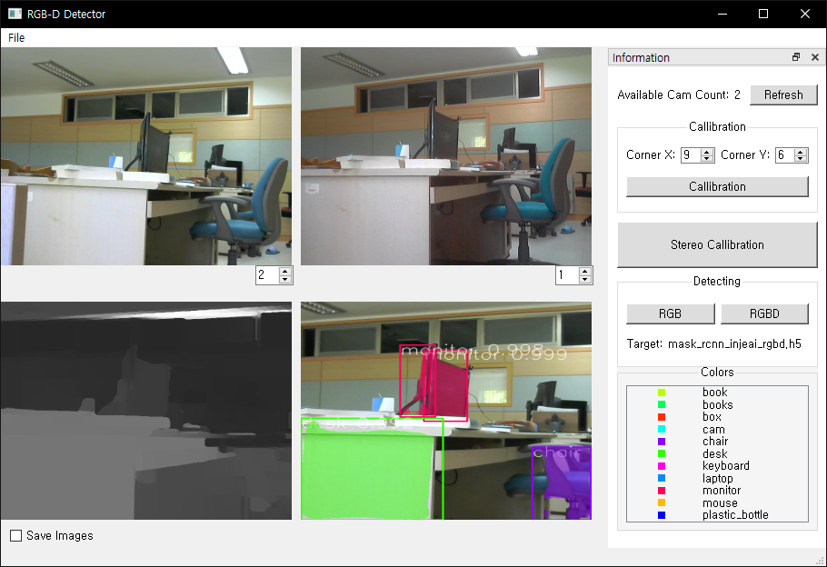
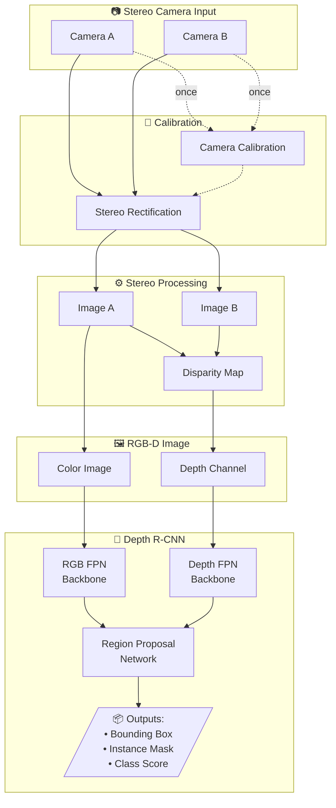
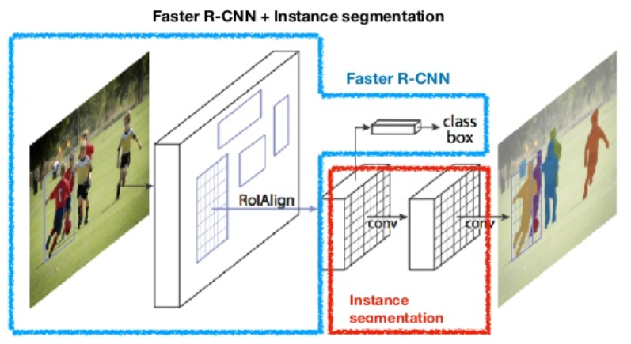
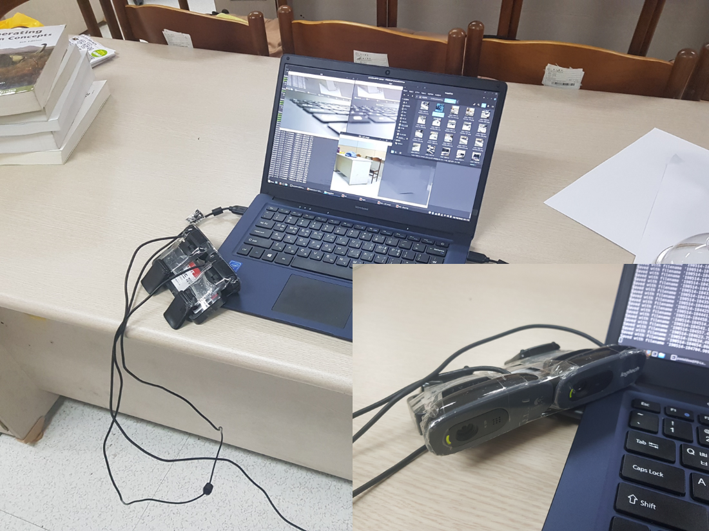
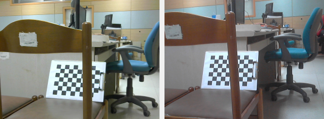
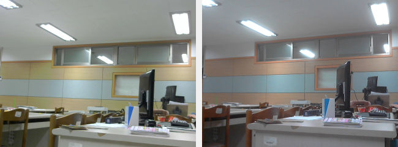

# PDStereo (RGB-D Mask R-CNN)

**Object Detection and Segmentation Based on Stereo Camera Features and Deep Learning**

스테레오 카메라 특징 값과 딥 러닝에 기반한 객체 검출과 분할 시스템


## Overview

This project proposes an object detection and segmentation system using RGB-D images obtained from stereo cameras and deep learning. The system extends Mask R-CNN with an additional depth feature pyramid network (Depth R-CNN) to improve detection accuracy by leveraging both color and depth information.

### Demo


*Real-time object detection with stereo cameras - detecting monitor, chair, box with bounding boxes and instance masks*

<details>
<summary>📸 GUI Screenshot</summary>



</details>

## Results

| RGB Detection | RGB-D Detection |
|:-------------:|:---------------:|
|  |  |

The RGB-D model (Depth R-CNN) detects more objects with higher confidence compared to the RGB-only model.

## System Architecture



### Mask R-CNN Architecture



## Hardware Setup



*Experimental setup with dual webcams configured as a stereo camera system*

## Camera Calibration



*Stereo camera calibration using chessboard pattern for intrinsic and extrinsic parameter estimation*

## Stereo Rectification

| Original Stereo Images | After Rectification |
|:----------------------:|:-------------------:|
|  |  |

*Epipolar line alignment for efficient disparity computation*

## Features

- **Stereo Camera Calibration**: Intrinsic and extrinsic parameter estimation using chessboard patterns
- **Stereo Rectification**: Epipolar line alignment for efficient depth computation
- **Disparity Map Generation**: SGBM (Semi-Global Block Matching) algorithm for depth estimation
- **Edge Feature Enhancement**: Sobel edge extraction from both color and depth images
- **Depth R-CNN Model**: Extended Mask R-CNN with separate Feature Pyramid Networks for RGB and depth channels
- **PyQt5 GUI**: Real-time detection interface with stereo camera support
- **Pixel-level Segmentation**: Instance segmentation with binary masks

## Requirements

* Python 3.6+
* [TensorFlow](https://github.com/tensorflow/tensorflow) 1.x
* [OpenCV](https://opencv-python-tutroals.readthedocs.io/en/latest/py_tutorials/py_tutorials.html) (cv2)
* [Mask R-CNN (Matterport)](https://github.com/matterport/Mask_RCNN)
* [PyQt5](https://www.riverbankcomputing.com/static/Docs/PyQt5/)
* NumPy, Keras

## Installation

1. Clone this repository
```bash
git clone https://github.com/PastelDew/PDStereo.git
cd PDStereo
```

2. Install dependencies
```bash
pip3 install -r requirements.txt
```

3. Run setup
```bash
python3 setup.py install
```

4. (Optional) For UI development
```bash
pip3 install pyqt-tools
```

## Project Structure

```
PDStereo/
├── DL/                 # Trained model weights (.h5 files)
├── PDStereo/           # Main application (PyQt5 GUI)
├── Training/           # Training scripts and configurations
├── mrcnn/              # Mask R-CNN / Depth R-CNN core implementation
├── assets/             # Images for documentation
├── RGB-D.py            # Entry point for RGB-D processing
├── requirements.txt
└── setup.py
```

## Usage

### 1. Camera Calibration

Capture chessboard images from both cameras for calibration:

```bash
python3 PDStereo/calibration.py --corner_x 9 --corner_y 6
```

### 2. Training

Prepare your dataset with LabelMe annotations (binary masks for each object), then:

```bash
python3 Training/train.py --dataset=/path/to/dataset --weights=coco --epochs=30
```

**Training Parameters:**
- Input: RGB images (3 channels) or RGB-D images (4 channels)
- Backbone: ResNet + FPN (Feature Pyramid Network)
- Pre-trained weights: COCO dataset
- Resolution: 640×480

### 3. Detection

Run detection with the trained model:

```bash
python3 RGB-D.py --image=/path/to/image --weights=DL/mask_rcnn.h5
```

### 4. GUI Application

Launch the PyQt5-based detection interface:

```bash
python3 PDStereo/main.py
```

The GUI supports:
- Dual webcam input (640×480)
- Real-time stereo rectification
- RGB and RGB-D detection modes
- Class visualization with color coding

## Model Architecture

### Depth R-CNN

The proposed Depth R-CNN extends Mask R-CNN by adding a separate Feature Pyramid Network for depth information:

| Component | Mask R-CNN | Depth R-CNN |
|-----------|------------|-------------|
| Input Channels | 3 (RGB) | 4 (RGB-D) |
| Feature Backbone | Single FPN | Dual FPN (RGB + Depth) |
| RPN | Shared | Depth-based |
| Output | Class, BBox, Mask | Class, BBox, Mask |

### Experimental Results

Training with 30 epochs (100 steps each, 30,000 total iterations):

| Loss Type | RGB (Mask R-CNN) | RGB-D (Depth R-CNN) | Improvement |
|-----------|------------------|---------------------|-------------|
| total_loss | 0.6536 | **0.5533** | ↓ 15.3% |
| mrcnn_class_loss | 0.2100 | **0.0743** | ↓ 64.6% |
| mrcnn_bbox_loss | 0.1185 | **0.1206** | - |
| mrcnn_mask_loss | 0.1796 | **0.2062** | - |

The Depth R-CNN model shows **15% lower total loss** and **65% lower classification loss** on validation data.

## Detected Classes

The model is trained to detect the following objects:

| Class | Count (Train) | Class | Count (Train) |
|-------|---------------|-------|---------------|
| chair | 75 | plastic_bottle | 40 |
| desk | 25 | books | 42 |
| monitor | 18 | laptop | 5 |
| box | 10 | cam | 28 |
| book | 5 | mouse | 10 |
| keyboard | 5 | | |

## Citation

If you use this project in your research, please cite:

```bibtex
@mastersthesis{song2019pdstereo,
  author = {송희준 (Song, Heejun)},
  title = {스테레오 카메라 특징 값과 딥 러닝에 기반한 객체 검출과 분할},
  school = {인제대학교 대학원},
  year = {2019},
  month = {6},
  type = {공학석사학위논문},
  department = {컴퓨터공학과},
  address = {김해, 대한민국}
}
```

**English:**
```bibtex
@mastersthesis{song2019pdstereo,
  author = {Song, Heejun},
  title = {Object Detection and Segmentation Based on Stereo Camera Features and Deep Learning},
  school = {Inje University Graduate School},
  year = {2019},
  month = {June},
  type = {Master's Thesis},
  department = {Department of Computer Engineering},
  address = {Gimhae, South Korea}
}
```

## References

- [Mask R-CNN](https://github.com/matterport/Mask_RCNN) - Matterport implementation
- K. He et al., "Mask R-CNN," ICCV 2017
- R. Hartley and A. Zisserman, "Multiple View Geometry in Computer Vision," Cambridge University Press, 2003
- H. Hirschmuller, "Stereo Processing by Semiglobal Matching and Mutual Information," PAMI 2008

## License

This project is licensed under the **GNU General Public License v3.0** - see the [LICENSE](LICENSE) file for details.

> **Note:** This project uses PyQt5 which is licensed under GPL v3. If you need a permissive license, consider migrating to PySide2/6 (LGPL).

## Acknowledgements

- [Matterport Mask R-CNN](https://github.com/matterport/Mask_RCNN)
- [LabelMe](http://labelme.csail.mit.edu/Release3.0/) annotation tool